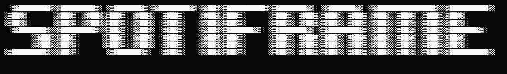
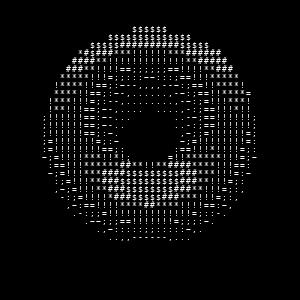
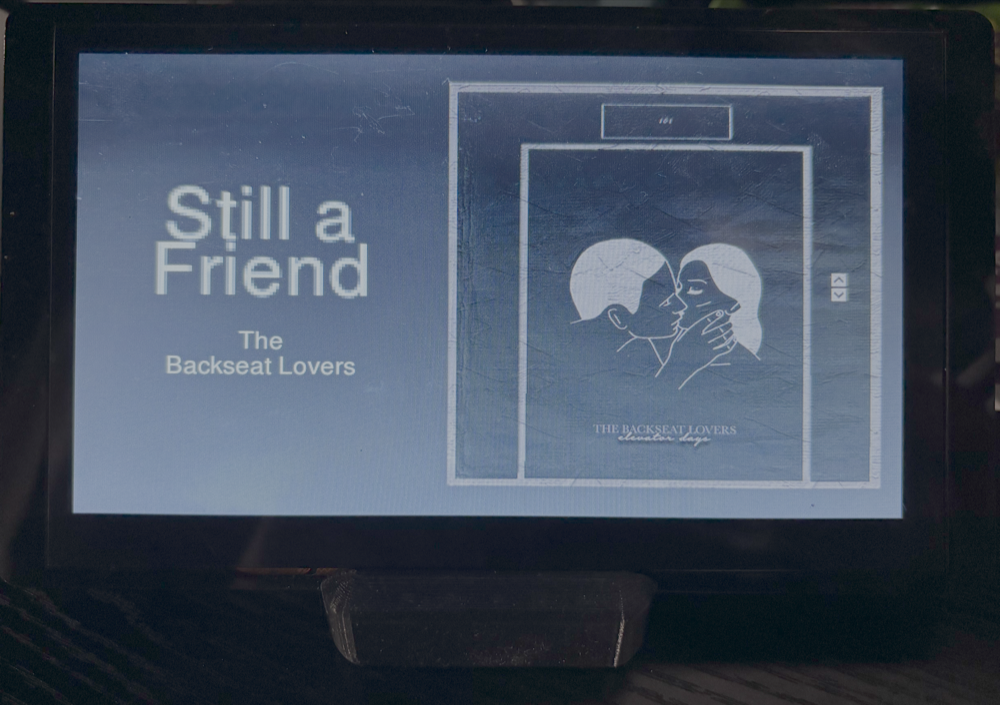

# Spotiframe

A digital music frame powered by an ESP32-S3 that displays the currently playing Spotify track, album artwork, artist information, and dynamically generated color themes.

Spotiframe connects to Spotify through a lightweight Flask backend, retrieves playback information in real time, and renders a custom touchscreen interface on a 7-inch display.

---

## Features

- Real-time Spotify playback information
- Album artwork display
- Dynamic UI colors extracted from album art
- Wi-Fi connected updates
- Animated ASCII donut screensaver
- Built on ESP32-S3 hardware

---

## ASCII Donut Screensaver 🍩

One of my favorite features of Spotiframe is a rotating ASCII-art donut screensaver inspired by Andy Sloane's and a1k0n's classic terminal donuts.

The donut is rendered in real time on the ESP32-S3 using:

- Parametric torus geometry
- 3D rotation matrices
- Perspective projection
- Per-character depth buffering (z-buffer)
- ASCII brightness shading

Each frame is generated from thousands of sampled points on a torus, projected into screen space, and mapped to ASCII characters based on simulated lighting.

FYI: Strawberry frosted donuts are the best ones!

---

## Hardware

- Elecrow 7" ESP32-S3 HMI Display (800×480)
- ESP32-S3-WROOM
- Capacitive touchscreen

---

## Software Stack

### Device

- C++
- Arduino Framework
- LovyanGFX
- PNGdec

### Backend

- Python
- Flask
- Spotify Web API

### Deployment

- Render

---

## How It Works

1. Spotify playback data is retrieved through the Spotify Web API.
2. A Flask backend processes track metadata and album artwork.
3. Dominant colors are extracted from album art.
4. The ESP32 periodically requests playback updates.
5. Track information, artwork, and UI elements are rendered on the display.

---

## Gallery

### Now Playing Screen

### Screensaver

---

## Future Improvements

- Additional screensavers
- Multiple visual themes
- Touchscreen support

---

## License

MIT License
